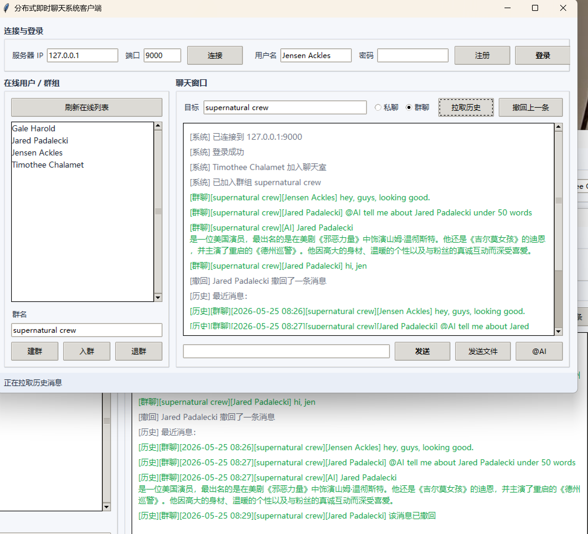
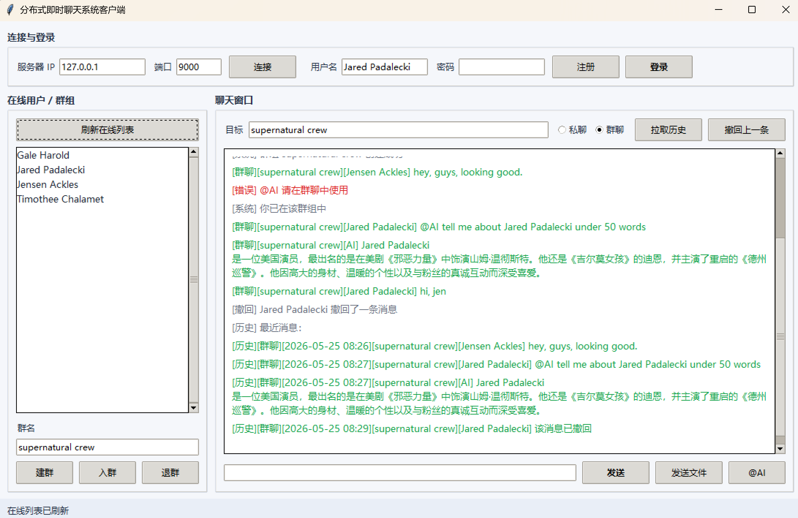

**设计与测试报告**

**概述**:
- **项目**: ChatSystem — 基于 TCP 的分布式聊天系统，支持私聊/群聊、消息撤回、历史查询、AI 群助手与数据库持久化。
- **目标读者**: 开发者、测试工程师、项目评审人员。

**系统架构概览**:
- **传输层**: 基于 TCP socket 的自定义 JSON Lines 协议，消息编码/解码见协议模块。
  - 实现文件: [common/protocol.py](common/protocol.py#L1-L80)
- **服务端**: 多线程 TCP 服务器，维护在线用户、群组、心跳检测与消息转发。
  - 实现文件: [server/server.py](server/server.py#L1-L200)
- **数据库**: SQLite，负责用户与消息持久化，包含迁移逻辑以兼容老表结构。
  - 实现文件: [server/database/db_manager.py](server/database/db_manager.py#L1-L200)
- **AI 集成**: 抽象为 llm_client，调用 OpenAI 兼容 SDK（DeepSeek 风格），在群内触发 @AI 自动回复。
  - 实现文件: [server/llm_client.py](server/llm_client.py#L1-L150)
- **客户端**: 包含命令行与 GUI（仓库中的 GUI 文件夹），以及客户端收发/心跳逻辑示例。
  - 实现文件: [client/client.py](client/client.py#L1-L200)

**核心功能设计与实现**:

1. **用户登录（在线管理）**
- 设计思路: 采用基于连接的会话模型，客户端在连接后发送 `login` 类型 JSON 获得登录许可，服务器在内存中维护 `online_users` 映射并广播上线/下线事件。用户名必须唯一。
- 具体实现:
  - 登录流程: 见 [server/server.py](server/server.py#L60-L140) 中 `login_client` 函数。
  - 在线维护: 在内存字典 `online_users`、`last_heartbeat` 中记录，会在 [heartbeat_monitor](server/server.py#L20-L60) 定期检测超时并下线（心跳超时阈值见常量 `HEARTBEAT_TIMEOUT`）。
  - 协议: 登录消息使用 `type: "login"`，服务器回应 `login_success` 或 `login_failed`。协议读写封装见 [common/protocol.py](common/protocol.py#L1-L80)。

2. **公聊 / 广播消息**
- 设计思路: 简单广播模型，收到 `chat` 类型消息后将带发送者标识的文本广播给所有在线用户，服务器并不把每条广播写入数据库（可扩展）。
- 具体实现:
  - 实现函数: [server/server.py](server/server.py#L200-L260) 中处理 `msg_type == 'chat'` 的分支与 `broadcast()` 函数。
  - 消息格式: `{"type": "chat", "content": "..."}`，客户端接收后按类型显示。

3. **私聊**
- 设计思路: 通过 `private_msg` 类型将消息发送给目标用户，若目标在线则直接转发并在数据库保存私聊记录。
- 具体实现:
  - 实现函数: [server/server.py](server/server.py#L140-L200) 中 `handle_private_message`。
  - 持久化: 使用 `db_manager.save_private_message(...)` 保存，消息发送成功后服务器会返回 `message_sent` 给发送者并将 `private_msg` 转发给接收者。

4. **群组管理与群聊**
- 设计思路: 轻量内存群组管理，支持建群、入群、退群，群消息同时写入 DB 并转发给在线群成员。AI 群助手以 `@AI` 为触发器，单独在后台线程调用 LLM。
- 具体实现:
  - 群操作: `group_create`, `group_join`, `group_leave` 在 [server/server.py](server/server.py#L120-L180) 的对应函数实现。
  - 群消息: `group_msg` 处理见 [server/server.py](server/server.py#L260-L360)。消息写入数据库: `db_manager.save_group_message(...)`。群内 AI 触发: `extract_ai_prompt` + 新线程调用 `handle_ai_group_reply`（见 [server/server.py](server/server.py#L300-L360)）。
  - AI 调用: [server/llm_client.py](server/llm_client.py#L1-L120) 中 `ask_llm` 函数通过 OpenAI 兼容 SDK 调用外部模型。

5. **消息撤回（Recall）**
- 设计思路: 在可回撤时间窗口内（默认 120 秒）允许发送者撤回消息；撤回会修改数据库记录并通知受影响的客户端显示撤回提示。
- 具体实现:
  - 实现函数: [server/server.py](server/server.py#L360-L460) 中 `handle_recall_message`。数据库逻辑在 `db_manager.recall_message(...)` 中实现（参见 DB 文件）。
  - 错误码与提示: `RECALL_FAILURE_MESSAGES` 常量统一管理错误提示。

6. **历史记录检索**
- 设计思路: 客户端可请求近期历史（默认 N 条），服务器查询数据库并返回结构化消息列表，客户端按类型渲染为私聊/群聊/系统条目。
- 具体实现:
  - 处理函数: [server/server.py](server/server.py#L460-L500) 中 `handle_history`，调用 `db_manager.get_recent_history(...)`。
  - 客户端打印/展示: [client/client.py](client/client.py#L1-L200) 中 `print_history` 用于命令行客户端的展示格式。

7. **心跳/在线检测**
- 设计思路: 客户端定期发送 `heartbeat`；服务器维护 `last_heartbeat` 时间戳并由 `heartbeat_monitor` 周期检测超时用户并下线。
- 具体实现:
  - 客户端心跳发送与服务器端处理参见 [client/client.py](client/client.py#L120-L200) 与 [server/server.py](server/server.py#L180-L220)。

8. **数据库设计与迁移**
- 设计思路: 采用 SQLite，表结构支持向后迁移（检测老表结构并迁移），消息表包含撤回标记与时间，用户表保存密码与最后心跳。
- 具体实现:
  - 数据库初始化与迁移逻辑: [server/database/db_manager.py](server/database/db_manager.py#L1-L200)。

**测试计划与结果**:

- **测试环境**:
  - 操作系统: Windows
  - Python 版本: 建议 3.8+
  - 启动方式: 在项目根目录运行 `python server/server.py`，再启动若干客户端连接进行交互测试。

- **关键测试项（用例 -> 预期 -> 实际）**:
  1. 登录唯一性
     - 用例: 两个客户端尝试以相同用户名登录。
     - 预期: 第二个客户端收到 `login_failed` 提示且无法登录。
     - 实际: 通过 [server/server.py#L60-L120] 的检查，第二次登录被拒绝，符合预期。

  2. 私聊消息传递与持久化
     - 用例: A 向 B 发私聊，B 在线。
     - 预期: B 实时收到 `private_msg`，A 收到 `message_sent`，数据库中新增私聊记录。
     - 实际: `handle_private_message` 保存消息并转发（参见 [server/server.py#L140-L180]），数据库接口调用位于 `db_manager.save_private_message`。

  3. 群聊、AI 触发
     - 用例: 用户在群聊中发送 `@AI 请简述...`。
     - 预期: 群内收到 AI 名义的回复，且回复写入历史表。
     - 实际: `extract_ai_prompt` 成功解析触发词，后台线程调用 `ask_llm` 并通过 `send_group_message` 广播（参见 [server/server.py#L300-L360] 与 [server/llm_client.py](server/llm_client.py#L1-L120)）。

  4. 消息撤回
     - 用例: 发送者在 2 分钟内撤回消息。
     - 预期: 消息在数据库标记为已撤回，并向相关客户端发送 `recall_notice`。
     - 实际: `handle_recall_message` 触发 `db_manager.recall_message` 并通知在线接收方（参见 [server/server.py#L360-L420]）。

  5. 心跳超时下线
     - 用例: 客户端停止发送心跳超过 `HEARTBEAT_TIMEOUT`。
     - 预期: 服务器将该用户移除并广播离线系统消息。
     - 实际: `heartbeat_monitor` 在检测到超时后调用 `mark_user_offline`，符合预期（参见 [server/server.py#L10-L60]）。

**测试截图（演示）**:
- 请将测试时的客户端 GUI 截图放入 `docs/screenshots/` 文件夹，文件名示例：`screenshot1.png`, `screenshot2.png`。
- 附：本次测试记录包含两张演示截图，说明如下：
  - screenshot1.png: 登录后群聊与 AI 回复示例（界面显示 @AI 触发与 AI 返回的绿色文本）。
  - screenshot2.png: 私聊/历史记录与群组列表显示（显示用户列表、历史拉取结果与撤回提示）。

演示截图：

**复现步骤（快速）**:
- 1. 启动服务: `python server/server.py`
- 2. 在不同终端或 GUI 客户端中启动多个客户端连接并登录。
- 3. 进行私聊、群聊、建群、入群、发起 @AI 提问、撤回消息、请求历史等操作，观察服务器日志与客户端反馈。

**结论**:
- 当前实现已覆盖基础聊天功能、群组与 AI 辅助场景，并包含消息撤回与历史查询等常见能力。上述功能可在本地实验环境稳定运行；若用于生产需针对认证、安全、持久化与扩展做进一步工程化改造。

---
作者: 吕琦融、张蓥、王迎朱、谢可颖
日期: 2026-05
