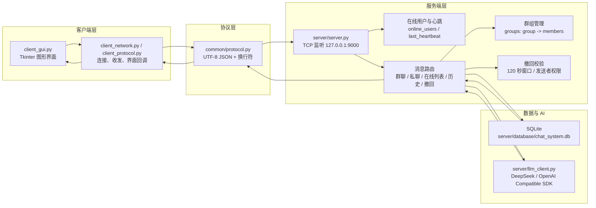
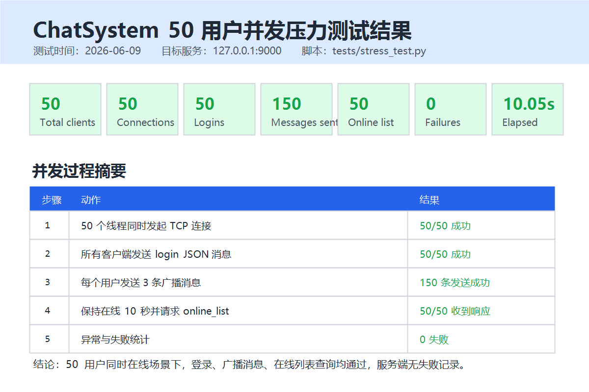

# ChatSystem 设计与测试报告

## 1. 项目概述

ChatSystem 是一个基于 TCP Socket 的本地分布式聊天系统。系统采用 C/S 架构，客户端提供图形界面，服务端负责连接管理、协议解析、消息分发、群组管理、消息持久化、撤回校验与 AI 群助手调用。

本报告依据当前代码结构整理，主要参考：

- `client_gui.py`：桌面客户端界面与用户交互。
- `server/server.py`：TCP 服务端、在线用户、群聊、私聊、撤回、AI 触发。
- `common/protocol.py`：JSON Lines 协议收发封装。
- `server/database/db_manager.py`：SQLite 持久化、历史记录、撤回状态维护。
- `server/llm_client.py`：DeepSeek/OpenAI 兼容接口调用。
- `tests/stress_test.py`：50 用户并发压力测试脚本。

## 2. 系统设计

### 2.1 系统架构图



### 2.2 模块职责

| 模块 | 主要职责 |
| --- | --- |
| `client_gui.py` | 提供登录、注册、建群、入群、群聊、私聊、在线用户列表、历史查询、撤回上一条、`@AI` 快捷发送等界面能力。 |
| `common/protocol.py` | 将每条消息编码为 `UTF-8 JSON + \n`，服务端和客户端通过同一规则发送与解析。 |
| `server/server.py` | 启动 TCP 服务、为每个连接创建线程、维护在线用户、处理登录/心跳/聊天/群组/撤回/历史/在线列表。 |
| `server/database/db_manager.py` | 初始化 SQLite 表结构，保存私聊和群聊消息，查询历史消息，执行撤回状态更新。 |
| `server/llm_client.py` | 从 `.env` 或环境变量读取 DeepSeek 配置，通过 OpenAI 兼容 SDK 调用大模型。 |
| `tests/stress_test.py` | 创建 50 个模拟客户端线程，同时连接、登录、发送消息、保持在线并请求在线列表。 |

## 3. 协议定义

### 3.1 基础传输格式

协议采用 JSON Lines。每个业务消息都是一个 JSON 对象，编码为 UTF-8，并以单个换行符结束：

```python
json.dumps(data, ensure_ascii=False) + "\n"
```

因此一条登录消息在线路上的形式如下：

```json
{"type":"login","username":"test"}
```

后面紧跟 `\n` 作为消息边界。接收端按字节读取，遇到换行后反序列化为 JSON 对象。

### 3.2 客户端请求消息示例

**登录**

```json
{
  "type": "login",
  "username": "test"
}
```

成功响应：

```json
{
  "type": "login_success",
  "content": "登录成功"
}
```

失败响应：

```json
{
  "type": "login_failed",
  "content": "用户名已在线"
}
```

**心跳**

```json
{
  "type": "heartbeat"
}
```

服务端收到后刷新 `last_heartbeat[username]`。心跳监控线程每 5 秒检查一次，超过 30 秒未更新则将用户移出在线表并广播离线通知。

**大厅广播**

```json
{
  "type": "chat",
  "content": "hello everyone"
}
```

服务端广播：

```json
{
  "type": "chat",
  "content": "[test] hello everyone"
}
```

**私聊**

```json
{
  "type": "private_msg",
  "to": "test_1",
  "content": "hihi"
}
```

目标用户收到：

```json
{
  "type": "private_msg",
  "message_id": 44,
  "from": "test",
  "content": "hihi"
}
```

发送方收到确认：

```json
{
  "type": "message_sent",
  "message_id": 44,
  "msg_type": "private",
  "to": "test_1"
}
```

**建群、入群、退群**

```json
{
  "type": "group_create",
  "group": "group1"
}
```

```json
{
  "type": "group_join",
  "group": "group1"
}
```

```json
{
  "type": "group_leave",
  "group": "group1"
}
```

**群聊**

```json
{
  "type": "group_msg",
  "group": "group1",
  "content": "hello"
}
```

群成员收到：

```json
{
  "type": "group_msg",
  "message_id": 45,
  "group": "group1",
  "from": "test",
  "content": "hello"
}
```

**AI 群助手触发**

```json
{
  "type": "group_msg",
  "group": "group1",
  "content": "@AI 西游记的作者是谁"
}
```

AI 回复以普通群消息形式返回，发送者固定为 `AI`：

```json
{
  "type": "group_msg",
  "group": "group1",
  "from": "AI",
  "content": "《西游记》的作者是明代的吴承恩。"
}
```

**撤回消息**

```json
{
  "type": "recall",
  "message_id": 44
}
```

撤回成功后相关在线用户收到：

```json
{
  "type": "recall_notice",
  "message_id": 44,
  "msg_type": "private",
  "from": "test",
  "to": "test_1",
  "content": "test 撤回了一条消息"
}
```

撤回失败示例：

```json
{
  "type": "error",
  "content": "撤回失败：消息已超过 2 分钟可撤回时间"
}
```

**在线列表**

```json
{
  "type": "online_list"
}
```

响应：

```json
{
  "type": "online_list",
  "users": ["test", "test_1", "test2"]
}
```

**历史消息**

```json
{
  "type": "history"
}
```

响应：

```json
{
  "type": "history",
  "messages": [
    {
      "id": 45,
      "sender": "test",
      "receiver": null,
      "group_name": "group1",
      "content": "hello",
      "msg_type": "group",
      "timestamp": "2026-06-09 05:02:00",
      "is_recalled": 0,
      "recalled_at": null
    }
  ]
}
```

## 4. AI 功能实现逻辑

AI 群助手主要由 `server/server.py` 和 `server/llm_client.py` 协作完成。

1. 用户在群聊中发送 `group_msg`。
2. 服务端先校验群是否存在、用户是否属于该群。
3. 服务端调用 `db_manager.save_group_message(...)` 保存原始群消息。
4. 服务端将该消息广播给当前在线群成员。
5. 服务端通过 `extract_ai_prompt(content)` 判断是否触发 AI：
   - 只接受以 `@AI` 开头的消息。
   - `@AI` 后面可以跟空格、英文冒号或中文冒号。
   - `@AIxxx` 这类非分隔形式不会误触发。
6. 若触发 AI，服务端创建后台线程执行 `handle_ai_group_reply(...)`，避免阻塞当前群聊转发。
7. `ask_llm(prompt, sender_name, group_name)` 从 `.env` 读取：
   - `DEEPSEEK_API_KEY`
   - `DEEPSEEK_BASE_URL`，默认 `https://api.deepseek.com`
   - `DEEPSEEK_MODEL`，默认 `deepseek-v4-pro`
   - `DEEPSEEK_REASONING_EFFORT`，默认 `high`
8. `server/llm_client.py` 使用 OpenAI 兼容 SDK 发送对话请求，系统提示词要求 AI 以中文、简洁、清楚、友好的方式回答。
9. AI 返回后，服务端以 `from: "AI"` 的群消息格式广播给群成员，并写入 SQLite 历史记录。
10. 如果用户只发送 `@AI` 但没有问题，服务端返回提示语；如果 API 配置缺失或调用失败，服务端向群内返回可见错误说明。

该设计保证 AI 回复对客户端来说仍是普通群消息，客户端无需额外协议分支即可展示 AI 结果。

## 5. 消息撤回设计

消息撤回由服务端统一校验，避免客户端绕过限制。核心规则如下：

- 支持私聊消息和群聊消息撤回。
- 客户端可以发送 `recall`、`recall_message`、`recall_last` 或 `recall_request` 类型。
- 服务端从 `message_id`、`id` 或 `msg_id` 字段中读取目标消息 ID。
- 只有原发送者可以撤回自己的消息。
- 撤回时间窗口为 120 秒。
- 已撤回消息不能重复撤回。
- 数据库不物理删除消息，而是设置 `is_recalled = 1` 与 `recalled_at`。
- 查询历史时，已撤回消息内容统一显示为 `该消息已撤回`。
- 撤回成功后，服务端向相关在线用户发送 `recall_notice`。

## 6. 测试报告

### 6.1 测试环境

| 项目 | 内容 |
| --- | --- |
| 操作系统 | Windows 本地环境 |
| 服务端地址 | `127.0.0.1:9000` |
| 服务端启动 | `python server/server.py` |
| 压力测试脚本 | `python tests/stress_test.py` |
| 测试日期 | 2026-06-09 |
| 数据库 | `server/database/chat_system.db` |

### 6.2 功能测试结果

| 测试项 | 操作 | 预期结果 | 实际结果 |
| --- | --- | --- | --- |
| 登录 | 用户输入服务器地址、端口、用户名并登录 | 返回登录成功并加入在线列表 | 通过 |
| 建群/入群 | 创建 `group1` 并加入 | 服务端返回创建/加入成功 | 通过 |
| 群聊 | 在 `group1` 发送普通消息 | 群内成员可见该消息 | 通过 |
| 私聊 | 在群聊环境下切换私聊目标并发送消息 | 目标用户收到私聊，发送方收到发送确认 | 通过 |
| 在线列表 | 点击刷新在线列表 | 显示当前在线用户 | 通过 |
| AI 智能回复 | 群聊发送 `@AI 西游记的作者是谁` | AI 以群消息身份回复 | 通过 |
| 消息撤回 | 点击撤回上一条 | 120 秒内撤回成功并显示撤回提示 | 通过 |
| 历史查询 | 点击查找历史 | 返回最近私聊/群聊历史，撤回消息显示为已撤回 | 通过 |

### 6.3 并发压力测试结果：50 用户同时在线

压力测试使用 `tests/stress_test.py` 模拟 50 个客户端线程同时连接服务端。每个客户端完成以下流程：

1. 建立 TCP 连接。
2. 发送 `login` 消息并等待 `login_success`。
3. 连续发送 3 条广播消息。
4. 请求 `online_list`。
5. 保持在线 10 秒。
6. 发送 `quit` 并关闭连接。

实测命令：

```powershell
python tests\stress_test.py
```

实测输出：

```text
Stress test result
Target server: 127.0.0.1:9000
Total clients: 50
Successful connections: 50
Successful logins: 50
Messages sent successfully: 150
Online list responses: 50
Failures: 0
Total elapsed time: 10.05s
```

结果汇总：

| 指标 | 结果 |
| --- | ---: |
| 模拟客户端数 | 50 |
| 成功连接数 | 50 |
| 成功登录数 | 50 |
| 成功发送消息数 | 150 |
| 在线列表响应数 | 50 |
| 失败数 | 0 |
| 总耗时 | 10.05 秒 |

结论：在 50 个用户同时在线、共发送 150 条广播消息并同时请求在线列表的场景下，服务端连接处理、登录校验、消息广播与在线列表返回均正常，未出现失败记录。

### 6.4 测试截图

**AI 智能回复与消息撤回测试截图**

该截图来自 `C:\Users\LENOVO\Pictures\Screenshots\test_picture.png`，已替换到项目 `docs/screenshots/screenshot1.png`。截图中可见：

- 用户 `test` 登录并加入 `group1`。
- 群聊发送 `@AI 西游记的作者是谁`，AI 回复“《西游记》的作者是明代的吴承恩。”
- 群聊发送英文 AI 提问后，AI 返回英文人物介绍。
- 点击“撤回上一条”后，界面显示 `test 撤回了一条消息`。
- 历史消息中撤回记录显示为 `该消息已撤回`。


**多用户在线、群聊下私聊测试截图**

该截图来自 `C:\Users\LENOVO\Pictures\Screenshots\test_picture_1.png`，已替换到项目 `docs/screenshots/screenshot2.png`。截图中可见：

- 在线列表包含 `test`、`test2`、`test_1`，验证多用户同时在线。
- 用户 `test_1` 加入 `group1`。
- 群聊环境下切换为私聊目标 `test` 并发送 `hihi`。
- 界面返回 `[我 -> test] hihi` 与 `私聊消息已发送给 test`。
- 底部提示最近消息 ID 与 2 分钟内可撤回。


**50 用户同时在线压力测试截图**

该截图根据本次实测输出生成，保存为 `docs/screenshots/stress_test_50_users.png`。



## 7. 测试结论

当前代码结构清晰地分离了客户端界面、JSON Lines 协议、服务端业务路由、SQLite 持久化与 AI 调用。功能测试显示，系统已支持登录、在线列表、群聊、私聊、历史查询、AI 智能回复和消息撤回。压力测试显示，在 50 用户同时在线、150 条消息发送、50 次在线列表查询的场景下，服务端处理稳定，失败数为 0。

后续若用于更大规模或生产环境，建议继续补充身份认证、连接限流、消息分页、群成员持久化、服务端日志轮转和 AI 调用超时/重试策略。
